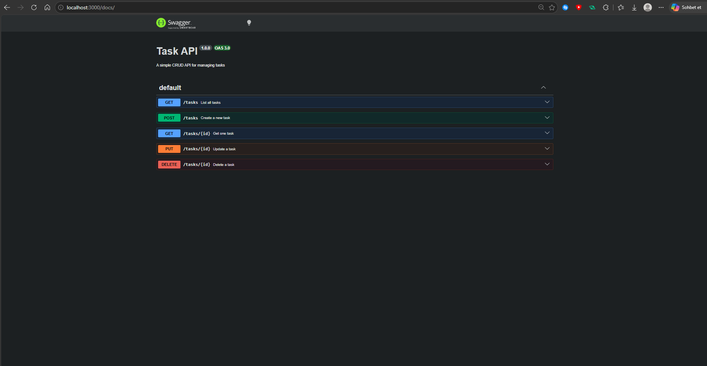

# Task API

A beginner friendly RESTful CRUD API for making a to-do list, made with Node.js and Express.
Task from the FlyRank Backend Internship (Week 2).

## What it does

Exposes five endpoints to create, read, update, and delete tasks. Data is stored
in memory (no database yet works in local — it resets on restart or shut down). Interactive documentation is
available at `/docs` via Swagger UI.

## Requirements

- Node.js 18 or newer
- npm

## Run it

```bash
npm install
node index.js
```

The server starts on `http://localhost:3000`.

Swagger UI: `http://localhost:3000/docs`

## Endpoints

| Method | Path          | Description        | Success | Errors       |
|--------|---------------|--------------------|---------|--------------|
| GET    | /             | API info           | 200     | —            |
| GET    | /health       | Health check       | 200     | —            |
| GET    | /tasks        | List all tasks     | 200     | —            |
| GET    | /tasks/:id    | Get one task       | 200     | 404          |
| POST   | /tasks        | Create a task      | 201     | 400          |
| PUT    | /tasks/:id    | Update a task      | 200     | 400, 404     |
| DELETE | /tasks/:id    | Delete a task      | 204     | 404          |

## Example request

```
GET /tasks HTTP/1.1
Host: localhost:3000

HTTP/1.1 200 OK
Content-Type: application/json; charset=utf-8

[
  { "id": 1, "title": "Learn Express", "done": false },
  { "id": 2, "title": "Build CRUD API", "done": false },
  { "id": 3, "title": "Push to GitHub", "done": false }
]
```

## Swagger UI



## Notes

Tasks live in memory only, so restarting the server resets the list to its
initial three tasks.

## Author

Baris Arda Tekin — FlyRank Backend AI Engineering Intern, Week 2
